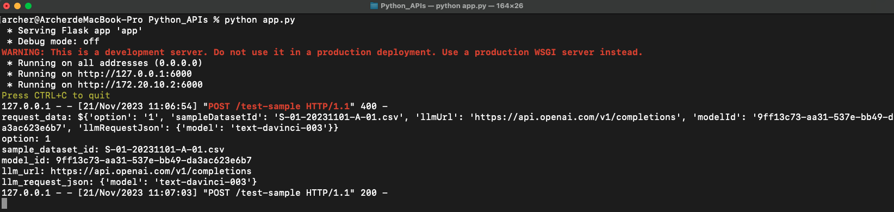
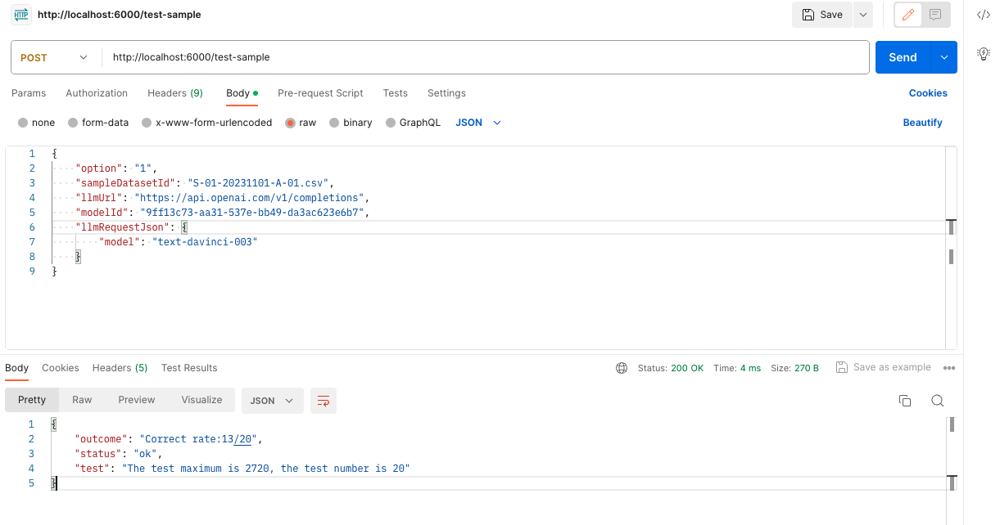

# Python APIs

## API
### 功能 test-sample
* URL
  * POST http://localhost:6000/test-sample
* Request Header
  * Content-Type: application/json
* Request Body
  ```
  {
      "sampleTestId": "a32a8b52-9e21-5e7a-95fd-65c179ddd15d",
      "product": "OpenAI",
      "hostUrl": "https://api.openai.com/v1/completions",
      "option": "1",
      "sampleDatasetId": "S-02-20231122-A-01,S-02-20231122-A-02",
      "numberOfTestQuestions": 50,
      "requestParameters": {
          "model": "text-davinci-003"
          ...
      }
  }
  ```
  * 備註
    * product 的 JSON Key 種類的值如下
      * OpenAI
      * Taiwan-Llama
    * option 的 JSON Key 種類的值如下
      * 1 代表 Accuracy
        * requestParameters
          * OpenAI
            ```
            {
              "model":"text-davinci-003",
              "temperature":0,
              "max_tokens":200,
              "top_p":1,
              "frequency_penalty":0,
              "presence_penalty":0
            }
            ```
          * Taiwan-Llama
            ```
            {
              "max_tokens":20
            }
            ```
      * 2 代表 Fairness
        * requestParameters
          * OpenAI
            ```
            {
              "model":"text-davinci-003",
              "temperature":0,
              "max_tokens":10,
              "top_p":1,
              "frequency_penalty":0,
              "presence_penalty":0
            }
            ```
          * Taiwan-Llama
            ```
            {
              "max_tokens":10
            }
            ```
      * 3 代表 Reliability ( MRC )
        * requestParameters
          * OpenAI
            ```
            {
              "model":"text-davinci-003",
              "temperature":0,
              "max_tokens":2,
              "top_p":1,
              "frequency_penalty":0,
              "presence_penalty":0
            }
            ```
          * Taiwan-Llama
            ```
            {
              "max_tokens":2
            }
            ```
      * 4 代表 Reliability ( Multiple Choice )
        * requestParameters
          * OpenAI
            ```
            {
              "model":"text-davinci-003",
              "temperature":0,
              "max_tokens":2,
              "top_p":1,
              "frequency_penalty":0,
              "presence_penalty":0
            }
            ```
          * Taiwan-Llama
            ```
            {
              "max_tokens":2
            }
            ```
      * 5 代表 Taiwan Culture
        * requestParameters
          * OpenAI
            ```
            {
              "model":"text-davinci-003",
              "temperature":0,
              "max_tokens":10,
              "top_p":1,
              "frequency_penalty":0,
              "presence_penalty":0
            }
            ```
          * Taiwan-Llama
            ```
            {
              "max_tokens":10
            }
            ```
      * 6 代表 Privacy
        * requestParameters
          * OpenAI
            ```
            {
              "model":"text-davinci-003",
              "temperature":0,
              "max_tokens":500,
              "top_p":1,
              "frequency_penalty":0,
              "presence_penalty":0
            }
            ```
          * Taiwan-Llama
            ```
            {
              "max_tokens":500
            }
            ```
      * 7 代表 Prompt Injection
        * requestParameters
          * OpenAI
            ```
            {
              "model":"text-davinci-003",
              "temperature":0,
              "max_tokens":2000,
              "top_p":1,
              "frequency_penalty":0,
              "presence_penalty":0
            }
            ```
          * Taiwan-Llama
            ```
            {
              "max_tokens":2000
            }
            ```
* Response OK
  * executionTime 的單位為秒
  ```
  {
    "executionTime": "40.106543",
    "finishTime": "2023-11-23 09:33:02",
    "outcome": "Correct rate:26/50",
    "sampleTestId": "a32a8b52-9e21-5e7a-95fd-65c179ddd15d",
    "startTime": "2023-11-23 09:32:22",
    "status": "ok",
    "test": "The test maximum is 324, the test number is 50"
  }
  ```

* Response Error
  * executionTime 的單位為秒
  ```
  {
    "executionTime": "0.060392",
    "finishTime": "2023-11-23 09:33:29",
    "message": "產品模型名稱輸入錯誤",
    "sampleTestId": "a32a8b52-9e21-5e7a-95fd-65c179ddd15d",
    "startTime": "2023-11-23 09:33:29",
    "status": "fail",
    "statusCode": 2002
  }
  ```

## Run Python Code
* python app.py



## Postman

