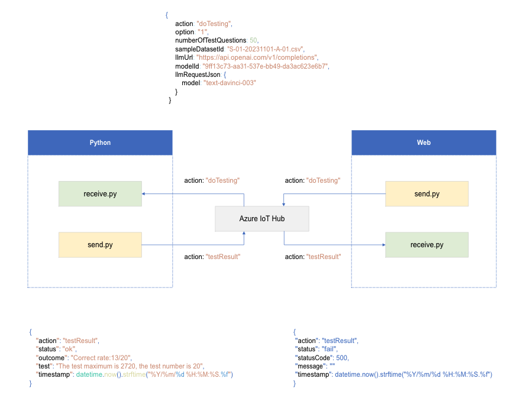

## Flow


## Request Body
```
{
    action: "doTesting",
    "option": "1",
    "numberOfTestQuestions": 50,
    "sampleDatasetId": "S-01-20231101-A-01.csv",
    "llmUrl": "https://api.openai.com/v1/completions",
    "modelId": "9ff13c73-aa31-537e-bb49-da3ac623e6b7",
    "llmRequestJson": {
        "model": "text-davinci-003"
    }
}
```

## Response OK
```
{
    "action": "testResult",
    "status": "ok",
    "outcome": "Correct rate:13/20",
    "test": "The test maximum is 2720, the test number is 20"
}
```

## Response Error - LLM 端的錯誤
```
{
    "action": "testResult",
    "status": "fail",
    "statusCode": 500,
    "message": ""
}
```

## Response Error - Tool 端的錯誤
```
{
    "action": "testResult",
    "status": "fail",
    "statusCode": 999,
    "message": ""
}
```