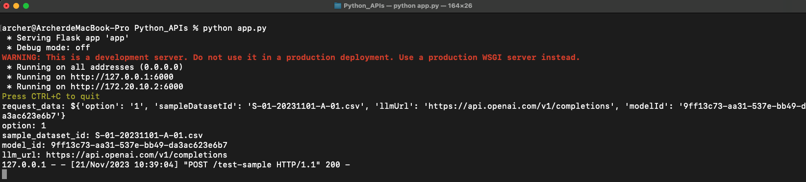
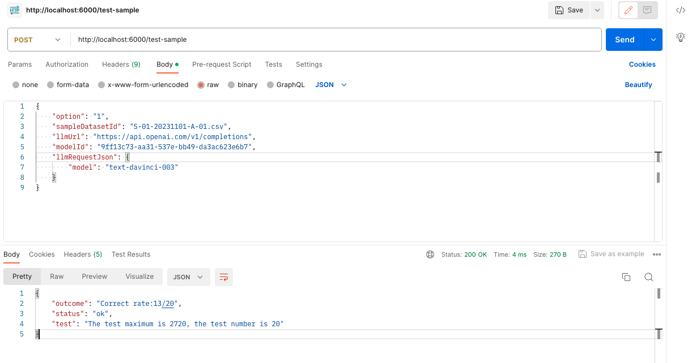

# Python_APIs

## API
### test-sample
* URL
  * POST http://localhost:6000/test-sample
* Request Header
  * Content-Type: application/json
* Request Body
```
{
    "option": "1",
    "sampleDatasetId": "S-01-20231101-A-01.csv",
    "llmUrl": "https://api.openai.com/v1/completions",
    "modelId": "9ff13c73-aa31-537e-bb49-da3ac623e6b7"
}
```

## Run Python Code
* python app.py



## Postman
